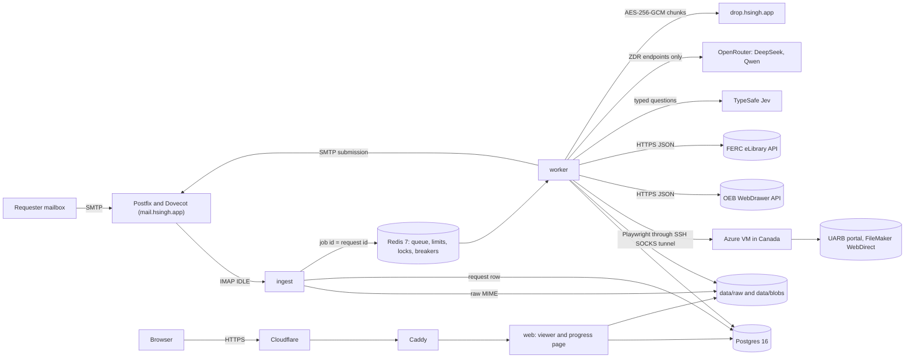
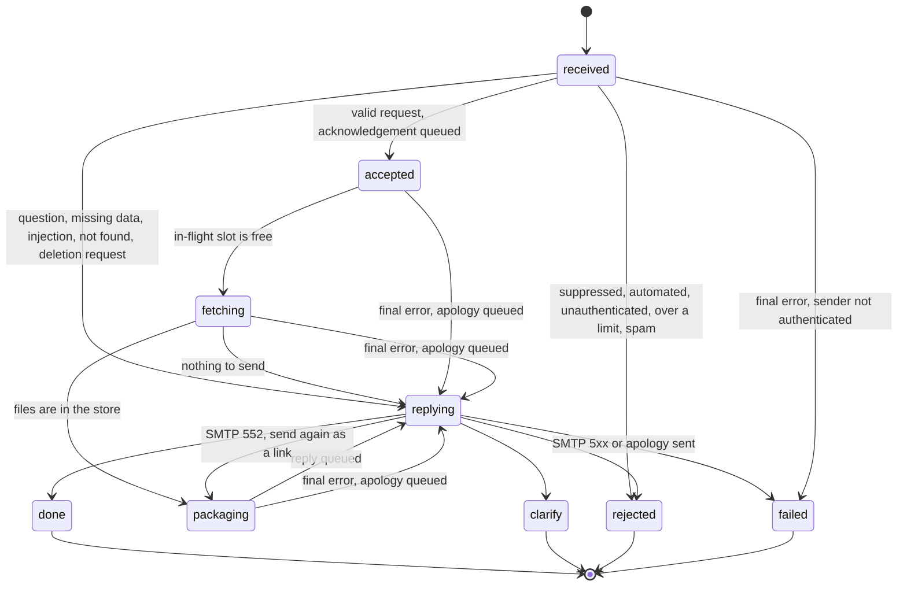

# Design: Regulatory Document Agent

This document is written in ASD-STE100 Simplified Technical English.

NOTE: This system is an MVP for evaluation. It is not a production service, and it has no service level agreement (SLA). Read [Limitations and disclaimers](docs/guide/limitations-and-disclaimers.md) before you use any number in this document.

The [README](README.md) tells what the agent does. This document tells why the agent has this design. It gives the goals, the architecture, the request lifecycle, the decisions, the failure classes and the path to scale. The [documentation map](docs/guide/index.md) shows where to find more detail.

NOTE: Other documents refer to sections 1 to 7 of this document by number. Do not change the section numbers.

## 1. Goals

The goals are in priority order. When 2 goals conflict, the higher goal wins.

1. Do not send wrong data, and do not send data to the wrong person.
2. Do not go silent. Each authenticated request gets exactly 1 useful reply.
3. Use the regulator portals and the models only when it is necessary.
4. Add a regulator without a change to the pipeline.

A wrong document under a correct title is worse than a slow request. A reply to a spoofed address is worse than no reply. A reply to an autoresponder can start a mail loop.

"Useful reply" means 1 of these: the documents, a question about the request, a clear "not found" answer, or an apology after the retries stop.

A repeat request for the same documents within 6 h does not touch the portal or a model. The cache of document lists, the file store and the summary cache give this result.

## 2. Architecture and design decisions

### 2.1 Components

All listeners of the agent bind to 127.0.0.1. Caddy is the only public entry point for HTTP. The app containers use the host network mode because the browser must reach the SOCKS tunnel on the host loopback.

| Process | What it does | Database role |
|---|---|---|
| `ingest` | Reads the mailbox with IMAP IDLE. Stores each message, inserts a request row and puts a job on the queue. | `agent_app` |
| `worker` | Runs the gate and the providers. Makes the packages and the summaries. Sends the outbox mail. Runs the sweeper and the daily jobs. | `agent_app` |
| `web` | Serves the citation viewer, the progress page, `/status`, `/privacy` and `/health`. | `agent_web` (read-only) |
| `migrate` | Applies the SQL migrations, 1 time for each deploy. | `agent_migrator` |
| `db-grants` | Applies `deploy/sql/grants.sql` after each migration. | `agent_migrator` |
| `retention` | Runs `ragent purge` from a systemd timer. | `agent_retention` |

For the full component description, read [Architecture](docs/guide/architecture.md).

### 2.2 Design decisions

| Decision | Alternatives | Reason |
|---|---|---|
| Deterministic browser automation (Playwright) for the UARB portal. No model controls the browser. | An agentic browser or computer use | The portal workflow is fixed. Deterministic code is fast and testable. Text on a page cannot steer it. |
| Plain HTTP with JSON for the OEB and FERC portals | A browser for all portals | The APIs give structured records. They are faster than a browser, and a page layout change does not break them. |
| Triage in this order: rules, then TypeSafe Jev, then the LLM | An LLM for each email | The rules decide simple requests in less than 1 ms at no cost. Jev only selects from closed sets. The LLM gets only the emails that Jev is not sure about. |
| A state machine in Postgres with compare-and-set (CAS) transitions, and an arq queue on Redis | Temporal, Celery | 1 durable source of truth with 2 dependencies is enough at this scale. Each step is idempotent, so a later move to Temporal is possible. |
| A content-addressed file store (SHA-256) | 1 folder for each request | The store keeps identical files 1 time. Writes are atomic. Viewer URLs do not change. |
| An end-to-end encrypted drop link, with an attachment as the fallback | Attach each ZIP | A ZIP can be larger than the mail size limit. The drop server stores only ciphertext. The key is only in the URL fragment. |
| The agent itself calculates SPF, DKIM and DMARC alignment | Trust the From header | The local MTA does not add Authentication-Results. A reply to unauthenticated mail makes the agent a spam reflector. |
| Each summary claim must quote its page | A free-form summary | Code finds each quote in the text that the agent extracted. Code removes each claim that it cannot locate. |
| A small provider interface. Each provider declares its matter format and its categories. | 1 scraper | UARB, OEB and FERC use the same pipeline. |
| The provider compares each UARB download with the requested id. A Redis lock serialises the click-to-file step for each egress IP. | Trust the file that the portal serves | The live portal served the file of another session under the requested name. |
| An outbox. The worker renders each email and stores it in the same transaction as the state change. The Message-ID is deterministic. | Send from the job directly | After a crash between "send" and "commit", the agent sends the same message again, never a different message. |
| Postgres counts the attempts. Each request has a deadline of 2 h. | The retry counter of the queue | The arq counter starts again at 1 when the sweeper puts a job back on the queue. |
| Circuit breakers in Redis, 1 for each dependency | No breakers, or 1 breaker set in each process | All worker processes share 1 view. A request waits ("parks") and does not use an attempt. |
| Least-privilege Postgres roles, a Redis ACL and a JSON job format | 1 superuser connection and pickle | A compromised process gets less access. A process that can write to Redis cannot run code in a worker. |
| 1 Canadian egress for UARB through an SSH SOCKS tunnel | A pool of egress IPs, or a residential proxy | It is simple and cheap, and it is enough for the MVP. The single point of failure is a known risk ([section 7](#7-trade-offs-and-next-steps)). |

The [decisions log](docs/guide/decisions-log.md) has 1 entry for each decision, with its date.

## 3. Request lifecycle and state machine

### 3.1 States

| State | Description |
|---|---|
| `received` | Ingest stored the message and the request row. |
| `accepted` | The gate accepted the request. The acknowledgement is in the outbox. |
| `fetching` | The provider lists and downloads the documents. |
| `packaging` | The worker makes the ZIP, uploads it and writes the cited summary at the same time. |
| `replying` | The reply is in the outbox. The request moves to its final state when the outbox sends the reply. |
| `done` | The outbox sent the reply. |
| `clarify` | The agent asked a question. A reply from the requester starts a new request. |
| `rejected` | The agent did not process the request. Most rejected requests get no reply. |
| `failed` | The retries stopped. An authenticated sender got 1 apology. Each `failed` request writes a `dead_letter` event. |

`done`, `clarify`, `rejected` and `failed` are "settled" states. A job for a settled request does nothing.

### 3.2 Sequence for a valid request

1. Ingest reads the message with `BODY.PEEK`, so the message stays unread.
2. Ingest applies the inbound ceiling and the pre-authentication limits.
3. Ingest stores the raw MIME and inserts the request row. The row is unique on Message-ID.
4. Ingest puts a job on the queue. The job id is the request id.
5. Ingest sets the `\Seen` flag on the message.
6. The worker takes a per-request lock and counts 1 attempt in Postgres.
7. The gate does its checks in a fixed order (refer to [Request flow](docs/guide/request-flow.md)).
8. The gate moves the request to `accepted` and queues the acknowledgement in the same transaction.
9. The worker gets an in-flight slot for the sender and moves the request to `fetching`.
10. Under a single-flight lock, the worker reads the cache or calls the provider.
11. The worker makes the package and the summary at the same time.
12. The worker queues the reply with the move to `replying`, then sends it.
13. The outbox marks the reply as sent and moves the request to `done` in 1 transaction.

### 3.3 Idempotency

| Hazard | Guard |
|---|---|
| The same email arrives 2 times | `UNIQUE(message_id)`. The second insert does nothing. |
| A crash after the IMAP fetch and before the commit | The message stays unread. The next sweep reads it again. |
| 2 jobs for 1 request | The job id is the request id. A Redis lock for each request stops overlap. |
| A crash between the SMTP send and the commit | The Message-ID is fixed before the send. The retry sends the same message. |
| A retry counts against a rate limit again | The rate-limit entry for a request uses the request id as its member. |
| A worker stops in the middle of a job | The sweeper puts requests that did not move for 15 min back on the queue. |
| 10 requests for the same matter at the same time | A single-flight lock for each (provider, matter, category). The other requests read the cache. |

[Reliability](docs/guide/reliability.md) has the full idempotency table.

## 4. Threat model

This table is a summary. [Security](docs/guide/security.md) has the full threat model and all controls.

| Threat | Control |
|---|---|
| A spoofed From address makes the agent send mail to a victim | The sender must pass DMARC alignment with SPF or DKIM. Failed mail gets no reply. |
| A replayed or changed message | DKIM must sign From and Subject. Signatures with `l=` do not count. Mail older than 3 days does not authenticate. |
| Duplicate headers confuse the parser | The parser rejects a message with a second From, Subject, Date or other single-instance header. |
| Autoresponder and mail loops | RFC 3834 headers, X-Loop, list headers, a null return path, our marker header, and thread and sender caps |
| Prompt injection in an email | The recipient never comes from content. Models only select from closed sets. Code writes all clarification text. |
| Prompt injection in a document | The prompt fences document text as data. Each claim must quote its page. Code compares figures with the quotes. |
| A flood of mail or requests | Pre-authentication limits, sender and domain caps, global caps, in-flight caps and daily budgets |
| Enumeration of other requests | Progress pages use a random 16-character token. The page masks the sender address. |
| Cross-site scripting or clickjacking in the viewer | Jinja autoescape, a strict Content-Security-Policy, Subresource Integrity, and `frame-ancestors 'none'` |
| Leaked credentials | Secrets only in `.env` (mode 600) and per-service env files. CI runs gitleaks. |
| Wrong document from the portal | The provider compares each download with the requested id, the size limit and the file type, and records its SHA-256. The agent never sends confidential rows. |

## 5. Failure classification

The most important distinction is "the portal did not answer" against "the portal said no".

| Signal | Class | Retried | The requester gets |
|---|---|---|---|
| A timeout, a proxy error, HTTP 5xx, 429 or 408 | `PortalUnavailable` | Yes. It counts against the breaker. | Nothing more until the retries stop, then 1 apology |
| A list of documents is empty but the portal count is not 0. A served file name is not the requested id. A response has an unexpected form. | `ScrapeError` | Yes | Nothing more until the retries stop, then 1 apology |
| UARB shows "No Records Found" 2 times in independent sessions | `MatterNotFound` | No | A message that says the matter is not in the public database of the regulator |
| OEB or FERC returns 0 records and a known canary case still returns records | `MatterNotFound` | No | The same "not found" text |
| HTTP 400 or 403 | `ProviderRejected` | No | An apology that says the regulator refused the request |
| A file or a request is larger than its budget | `TooLarge` | No | The files that fit, and the titles that did not fit |
| SMTP 5xx for our reply | `DeliveryFailed` | No | No reply is possible. The request ends `failed` with a `dead_letter` event. |
| SMTP 552 for a reply with an attachment | Relink | Yes | The same reply with a download link |
| Some files fail after their retries | Partial success | No | The documents that arrived, and the titles that failed |
| The LLM or TypeSafe does not answer | Degraded | No | Documents without a summary, or a question about the request |
| A breaker is open | Parked | Yes, without an attempt | Nothing more until the deadline |
| The sender is over the in-flight cap, or a portal is over its daily visits | Wait | Yes, without an attempt | 1 delay notice for a portal budget. 1 apology at the deadline. |
| DNS does not answer during sender authentication | Temporary | Yes | Nothing. On the final attempt, the agent drops the request silently. |
| A bug or an outage on our side | Internal | Yes | 1 apology that says the problem is on our side |

## 6. Path to scale

The MVP handles the volume of 1 mailbox on 1 host. Senpilot needs the full corpus of many regulators, warm and searchable. These changes are necessary. None of them is in the MVP.

1. Egress pool for each region. Add a second Canadian VM, or a residential proxy with sticky sessions. Give each egress IP its own download lock.
2. Continuous ingestion. A schedule for each regulator finds new matters and filings and downloads them into the same content-addressed store.
3. Workflow engine. Use Temporal with 1 workflow for each (regulator, matter) and 1 task queue for each regulator.
4. Search. Divide page text by document structure, keep page numbers, and use hybrid search (BM25 and vectors) with metadata filters.
5. Drift detection. Run a canary matter for each provider with known counts. Send an alert when the number of new documents for each day falls to 0.
6. Evals in CI. Run the gate eval and the output eval on each change to a model, a prompt or a threshold.

The UARB portal shares its prepared download state across guest sessions from 1 client IP. For this reason, the download lock must stay "1 for each egress IP". More egress IPs increase the download rate approximately in proportion.

NOTE: No fallback egress exists for UARB. The code has no residential proxy and no fallback proxy parameter ([ADR-023](docs/guide/decisions-log.md#adr-023-remove-the-unused-uarb_fallback_proxy-parameter)). The egress pool is the upgrade path.

A dedicated vector store is necessary only if recall or latency evals show it. Postgres with pgvector, partitioned by jurisdiction, is the first step. The MVP does not use pgvector.

## 7. Trade-offs and next steps

### 7.1 Trade-offs

| Choice | Cost | Why we accept it |
|---|---|---|
| 1 Canadian egress IP for UARB | A single point of failure. 1 lock serialises the UARB download step. | The MVP volume is small. The egress pool is the upgrade path. |
| 1 host, shared with other services of the operator | No isolation from those services. This is a SOC 2 gap. | It is an MVP. A dedicated host is on the path to production. |
| "Not found" must occur 2 times in independent sessions | A negative answer takes longer | A false "not found" is the most costly mistake of the agent. |
| Rows with an unknown access label are never downloaded | Some public files are not sent | A confidential file sent by mistake is worse than a file that is not sent. |
| Summaries read only PDF and DOCX text | The agent delivers scanned PDFs and spreadsheets but does not summarise or cite them | OCR is a next step. The reply tells the requester which files the summary did not read. |
| TypeSafe is not zero-data-retention on our plan | Email text and public document excerpts go to TypeSafe | The owner accepted this for the MVP. The privacy notice discloses it. `GATE_CLASSIFIER=llm` and `CITATION_CHECK=llm` stop it. |
| Retries continue for up to 2 h | A failed request takes up to 2 h to get its apology | Retries cover short portal outages. The requester gets 1 apology, not silence. |
| Email delivery is "at least once" | A rare duplicate of the same message | The 2 copies have the same Message-ID, so the recipient can identify the duplicate. A different second email is not possible. |
| The host network mode for the app containers | gVisor cannot isolate the worker yet | The tunnel sidecar removes this need (next steps). |

### 7.2 Next steps

1. Add OCR for scanned PDFs, so that the summary can cite them.
2. Add ARC evaluation for mail that comes through mailing lists.
3. Add the egress pool ([section 6](#6-path-to-scale)).
4. Move the SOCKS tunnel into a sidecar container. Then run the worker under gVisor.
5. Configure the off-site backup copy (`BACKUP_REMOTE`).
6. Send alerts to a person. Set an alert receiver and a watchdog receiver in Alertmanager ([Observability](docs/guide/observability.md)).
7. Add a nightly canary request for each provider, connected to an alert.
8. Answer questions about a matter from the cited corpus.
