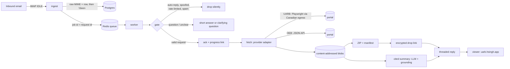

# Regulatory Document Agent

An email agent that fetches public utility-regulator filings and replies with the documents, a
plain-English summary, and a source link for every claim it makes.

> **Try it:** email **agent@hsingh.app**
> - "Can you send me the Other Documents for M12205?" (Nova Scotia UARB)
> - "Please send the Exhibits for M12383"
> - "Could you send me the latest decisions for EB-2024-0111?" (Ontario Energy Board)
>
> You get an acknowledgement with a live progress link within seconds, then the documents.

It started as the UARB take-home brief (email a matter number and a document type, get up to 10
files back in a ZIP with a metadata summary) and is built the way I'd build it for production:
safe to expose on the public internet, correct when the portal misbehaves, resumable after any
crash, and not tied to one regulator.

## What a reply looks like

```
M12205 is about Halifax Regional Water Commission - Windsor Street Exchange Redevelopment Project -
$69,275,000. It is a Water matter in the Capital Expenditure Approvals category. The matter was
received on April 7, 2025 and decided on October 23, 2025. Its status is Open. I found 13 Exhibits,
6 Key Documents, 43 Other Documents, and no Transcripts or Recordings.

I downloaded the 10 most recent of the 43 Other Documents and packaged them as a ZIP (10.6 MB).
[Download ZIP]  end-to-end encrypted link, expires October 11, 2026

Key points, each linked to the exact passage:
- The Board approved the application as amended for a total project cost of $59,143,000,
  inclusive of net HST.                                                         view source
- Halifax Water applied for approval ... for a cost of $64,769,000.             view source
...
```

"view source" opens the PDF page with the quoted passage highlighted:


The acknowledgement links to a live progress page:


## How it works



| Stage | What it does |
|---|---|
| **Ingest** | IMAP IDLE. Raw MIME is stored and the request row inserted (unique on Message-ID) before the message is marked read, so a crash can't lose or duplicate an email. |
| **Gate** | Loop and auto-reply detection (RFC 3834 and friends); SPF/DKIM/DMARC computed by the agent from its own MTA's Received header; Redis rate limits per sender, per domain and global; rules-first parsing with an LLM fallback. |
| **State machine** | `received → accepted → fetching → packaging → replying → done`. Compare-and-set transitions, an append-only event log, and resumable steps. |
| **Providers** | One adapter per regulator behind a small interface, each declaring its matter-number format and its own document categories (UARB's 5 tabs; OEB's 45 raw document types grouped into 9). UARB is FileMaker WebDirect driven by a browser; OEB is a WebDrawer JSON API over plain HTTP. |
| **Delivery** | ZIP with README and MANIFEST.csv (ids, titles, dates, SHA-256). Uploaded to drop as AES-256-GCM chunks with the key only in the link fragment, so the server never sees it. Attachment fallback. |
| **Citations** | Page text is extracted once per content hash. The LLM must quote verbatim; every quote is located in the page text (exact, then fuzzy with numbers protected), and claims or summary sentences with unsupported figures are removed. |

## Guarantees and how they're enforced

**Security**
- Replies only ever go to the *authenticated* sender: never Reply-To, never an address in the body, never anything an LLM produced.
- A sender passes only with a DMARC-aligned SPF or DKIM pass. Spoofed mail gets no reply at all, because answering it is how agents become spam reflectors.
- LLM output is parsed against a schema, matter numbers must literally occur in the email, categories come from a closed set, and email and document text is fenced as untrusted data.
- Our outbound mail carries `Auto-Submitted`, `X-Auto-Response-Suppress` and our own marker header, so autoresponders don't answer and our mail is recognised if it ever comes back.
- Secrets only in `.env` (mode 600). Containers bind to loopback; Caddy is the only way in. The viewer runs with a strict CSP.

**Accuracy**
- Every downloaded file is checked against the requested id (the portal names files after their id), plus non-empty, magic bytes and SHA-256.
- Counts are read from the portal's tab labels, never hard-coded. Metadata labels and values are paired by on-screen position, because the page renders values before labels.
- "Not found" is only believed after it reproduces in a fresh session. Timeouts are classified as "portal unavailable" (retry), never "not found".
- Confidential rows are listed but never sent, and the reply says how many were held back.

**Reliability**
- Retry with backoff for transient failures (20s → 10 min, 6 tries), then one apology email: never silence.
- Deterministic outbound Message-IDs are reserved before sending, so a crash between send and commit resends the same email, never a different one.
- A per-request lock stops overlapping jobs; a sweeper re-enqueues anything stuck.
- Single-flight per (provider, matter, category), and a content-addressed cache for listings, files, page text and summaries.

## Measured

| | |
|---|---|
| Acknowledgement | ~3 s after the email lands |
| Cold request, 10 PDFs from UARB | 32 s portal + 19 s summary, **~52 s** total (now overlapped) |
| Repeat request (cache) | **~3 s** |
| 4 concurrent requests, 2 matters, cold and warm | **69 s** wall clock, all first-try |
| OEB: 7 decisions for EB-2024-0111 (JSON API) | **41 s** including the cited summary |
| LLM cost per cold request | ~$0.006 |
| Tests | 453 unit + adversarial, 38 integration (incl. a fake third regulator end to end), live suites |

## Portal problems found and handled

These came up while building against the live UARB portal. Most public take-home solutions trip over at least one of them silently.

1. **Search raced the field commit.** Clicking *Search* straight after typing searches for an empty value and returns "No Records Found" for real matters (2 of 2 runs). Pressing Enter commits and submits (2 of 2 correct). A negative answer is then re-checked in a second session.
2. **Wrong file under the right name.** *GO GET IT* serves FileMaker's active record, and the prepared file is shared across concurrent guest sessions from one client. Session A asking for 102674 received the files sessions B and C had just requested. Every download is now verified against the requested id, and the click-to-download section is serialised across workers by a Redis lock.
3. **Virtualised grid.** Rows render only near the viewport, and rows in the DOM can still be outside the grid's own scroller, where clicks fail. The scraper scrolls the grid's scroller, not the window.
4. **Exhibits differ from other tabs.** They use exhibit numbers (`H-4(C)-iii`, `H-5(c)-ii`) instead of numeric ids, are listed oldest-first, and include confidential rows. Reply wording follows the actual order.
5. **Geo-blocking.** The portal only answers North American IPs. Egress for that provider goes through a Canadian SOCKS tunnel (systemd unit), with a residential proxy as fallback.

## Run it

```bash
cp .env.example .env && chmod 600 .env     # fill in mailbox, OpenRouter key, Postgres password
docker compose up -d --build               # postgres, redis, ingest, worker, web
docker compose logs -f worker
```

Local development:

```bash
uv venv --python 3.12 .venv && uv pip install --python .venv -e '.[dev]'
.venv/bin/playwright install chromium
.venv/bin/pytest -q                        # unit + adversarial corpus (no network)
.venv/bin/pytest -m integration -q         # pipeline against real Postgres/Redis, fake portal/LLM/SMTP
.venv/bin/pytest -m live -q                # real portals and drop (needs egress)
.venv/bin/python scripts/scrape.py M12205 "Other Documents" 10    # scraper only
```

## Layout

```
agent/
  mail/        ingest (IMAP IDLE), mime parsing, SPF/DKIM/DMARC, loop detection, outbound
  gate/        rules-first request parsing, LLM classifier
  providers/   provider interface, UARB (Playwright), OEB (JSON API), browser pool
  citations/   page extraction, quote grounding, cited summaries
  delivery/    ZIP packaging, encrypted drop upload, delivery policy
  web/         citation viewer, progress page
  pipeline.py  request state machine
  worker.py    queue worker, retries, sweeper
  store.py     persistence (CAS transitions, events, caches)
migrations/    SQL (idempotent)
tests/         unit, adversarial (29 hostile emails), integration, live
```

See [DESIGN.md](DESIGN.md) for decisions, trade-offs, failure modes and how this scales to every regulator.

## Known limitations

- Scanned PDFs with no text layer are delivered but not cited (OCR is the next step).
- ARC isn't evaluated, so mail forwarded through lists that break both SPF and DKIM is treated as unauthenticated.
- One Canadian egress IP means UARB downloads are serialised; more egress IPs (each with its own lock) scale that linearly.
