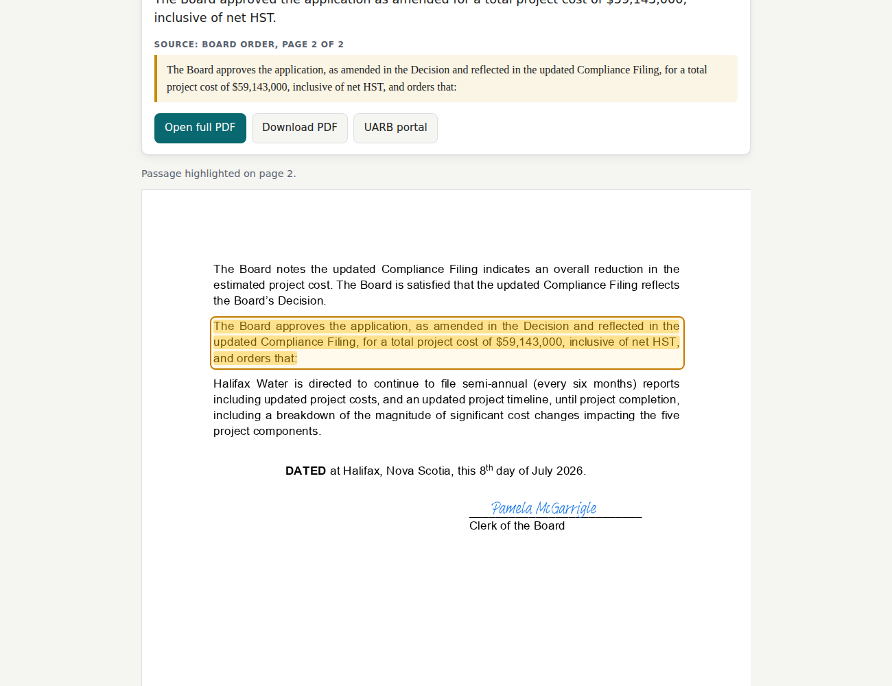
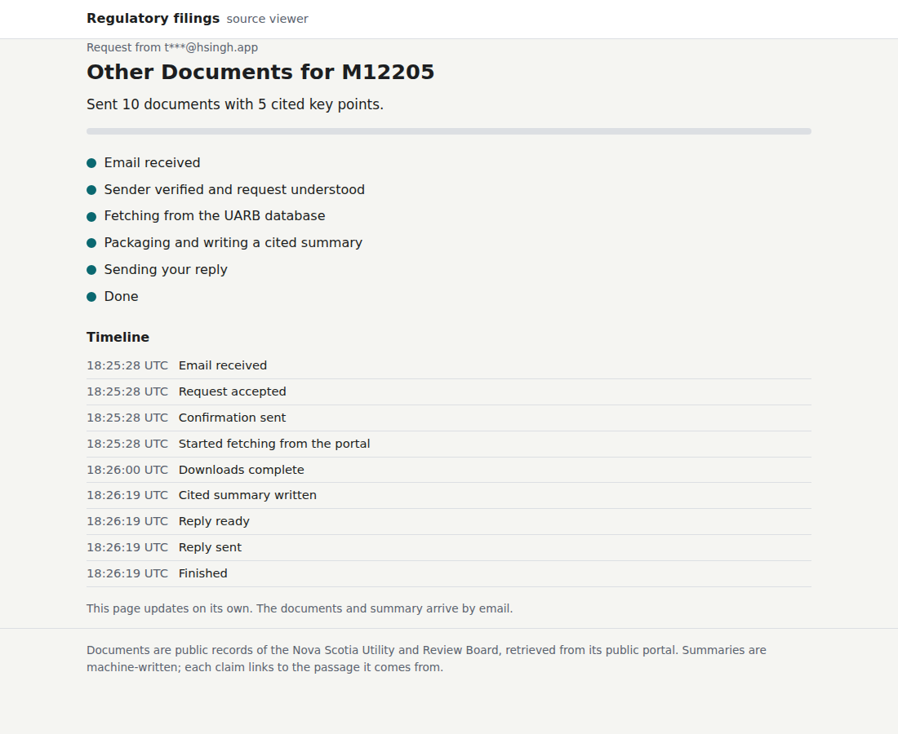
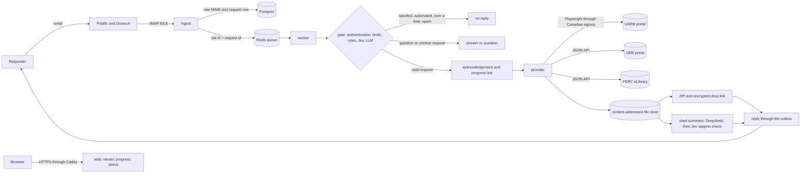

# Regulatory Document Agent

This document is written in ASD-STE100 Simplified Technical English.

The Regulatory Document Agent is an email agent for public utility regulator filings. You send it an email that names a matter and a document category. The agent gets the documents from the portal of the regulator. It replies with the documents, a short summary and key points. Each key point links to the exact passage in its source document.

NOTE: The agent is an MVP for evaluation. It is not a production service, and it has no service level agreement (SLA). Read [Disclaimers](#10-disclaimers) before you use a reply or a number from this document.

## 1. What the agent does

The agent supports 3 regulators:

| Regulator | Matter format | Example | Categories | Portal access |
|---|---|---|---|---|
| Nova Scotia Utility and Review Board (UARB) | `M` and 5 digits (`M12345`) | `M12205` | 5: Exhibits, Key Documents, Other Documents, Transcripts, Recordings | Playwright browser through 1 Canadian egress |
| Ontario Energy Board (OEB) | `EB-YYYY-NNNN` | `EB-2024-0111` | 9, for example Decisions and Orders, Interrogatories, Undertakings | JSON API over HTTPS |
| US Federal Energy Regulatory Commission (FERC) | Docket, with an optional sub-docket | `ER24-1234-000`, `RM22-14` | 8, for example Orders and Decisions, Notices, Comments and Protests | Internal JSON API of eLibrary over HTTPS |

For each valid request, the agent does these tasks:

- It finds the matter, the category and the number of documents in the email.
- It downloads up to 10 documents of that category from the portal.
- It puts the documents in a ZIP file with a `README` and a `MANIFEST.csv` (ids, titles, dates and SHA-256 values).
- It writes a summary in which each key point quotes its page.
- It replies in the same email thread.

[Providers](docs/guide/providers.md) gives the categories of each regulator and the problems of each portal.

## 2. Try it

NOTE: The agent replies only to a sender that passes DMARC alignment with SPF or DKIM. Mail from a domain without SPF or DKIM gets no reply. Mail through a mailing list that breaks both SPF and DKIM also gets no reply.

1. Send an email from your own mailbox to **agent@hsingh.app**.
2. In the email, write 1 matter number and 1 document category.
3. Wait for the acknowledgement.
4. Open the progress link in the acknowledgement.
5. Wait for the reply with the documents.

Example sentences:

| Regulator | Example sentence |
|---|---|
| UARB | "Can you get me the Other Documents filed in M12205?" |
| UARB | "Send me up to 5 Key Documents for M12383." |
| OEB | "Can you send me the procedural orders in EB-2025-0064?" |
| OEB | "Send the 2 most recent decisions in EB-2023-0195." |
| FERC | "Send the orders issued in docket ER24-1234-000." |
| FERC | "Can you send me the notices for RM22-14?" |

### 2.1 What you get

1. An acknowledgement within seconds. It has a link to a live progress page.
2. A reply in the same thread. The reply contains:
   - 1 sentence about the matter, and the number of documents in each category;
   - an end-to-end encrypted download link for the ZIP file (the link expires after 7 days or 25 downloads);
   - a short summary of the documents;
   - key points, each with a "view source" link to the quoted passage on its page.

If the request is not clear, the agent asks 1 question. If the matter does not exist, the agent tells you. If the retries stop, the agent sends 1 apology.

Example of a reply (shortened):

```
M12205 is about Halifax Regional Water Commission - Windsor Street Exchange Redevelopment Project -
$69,275,000. It is a Water matter in the Capital Expenditure Approvals category. The matter was
received on April 7, 2025 and decided on October 23, 2025. Its status is Open. I found 13 Exhibits,
6 Key Documents, 43 Other Documents, and no Transcripts or Recordings.

I downloaded the 10 most recent of the 43 Other Documents and packaged them as a ZIP (10.6 MB).
[Download ZIP]  end-to-end encrypted link, expires October 11, 2026

Key points, each linked to the exact passage:
- The Board approved the application as amended for a total project cost of $59,143,000,
  inclusive of net HST.                                                         view source
...
```

The "view source" link opens the PDF page and marks the quoted passage:



The progress page shows each step of the request:



## 3. Live links

| Page | URL | Contents |
|---|---|---|
| Status page (public) | https://uarb.hsingh.app/status | Health of the components, requests by final state, reply times, citation counts. Aggregate numbers only. |
| Dashboards (public, read-only) | https://uarb.hsingh.app/grafana/ | Grafana dashboards with aggregate metrics. No personal data and no request contents. |
| Privacy notice | https://uarb.hsingh.app/privacy | The data that the agent keeps, the retention periods and the vendors |
| Security contact | https://uarb.hsingh.app/.well-known/security.txt | How to report a vulnerability. [SECURITY.md](SECURITY.md) gives the policy. |

## 4. Architecture

3 processes do the work. `ingest` reads the mailbox and stores each message. `worker` runs the gate, the providers, the package, the summary and the outbox. `web` serves the citation viewer, the progress page, `/status` and `/privacy`. Postgres holds the state of each request. Redis holds the queue, the rate limits, the locks and the circuit breakers.



| Stage | What it does |
|---|---|
| Ingest | Stores the raw MIME and inserts the request row before it marks the message as read. A crash cannot lose or duplicate an email. |
| Gate | Detects loops and autoresponders. Calculates SPF, DKIM and DMARC alignment. Applies the rate limits. Parses the request with rules first, then TypeSafe Jev, then an LLM. |
| State machine | `received`, `accepted`, `fetching`, `packaging`, `replying`, then `done`. Compare-and-set transitions in Postgres, an append-only event log, and steps that can run again. |
| Providers | 1 adapter for each regulator behind a small interface. Each adapter declares its matter format and its categories. |
| Delivery | A ZIP file, uploaded to drop in AES-256-GCM chunks. The key is only in the URL fragment. An attachment is the fallback. |
| Citations | Code finds each quote in the extracted page text. Code removes claims that it cannot find, and sentences with figures that are not in the sources. |

[DESIGN.md](DESIGN.md) gives the design decisions, the failure classes and the path to scale. [Architecture](docs/guide/architecture.md) and [Request flow](docs/guide/request-flow.md) give the full detail.

## 5. Guarantees

### 5.1 Security

- The agent replies only to the authenticated sender. It never uses a `Reply-To` address, an address in the body or model output as the recipient.
- A sender must pass DMARC alignment with SPF or DKIM. Spoofed mail gets no reply, so the agent cannot become a spam reflector.
- Models only select from closed sets. Code validates each model answer. Email text and document text go to the models as fenced, untrusted data.
- Outbound mail has `Auto-Submitted`, `X-Auto-Response-Suppress` and a marker header. Autoresponders do not answer it, and the agent identifies its own mail if it returns.
- Secrets are only in `.env` (mode 600) and the per-service env files. Containers bind to 127.0.0.1. Caddy is the only public entry point.
- Each process has its own least-privilege Postgres role. Redis has an ACL. Jobs are JSON, not pickle.
- Rate limits apply before authentication, for each sender, for each domain, for all senders and for each day. [Abuse protection](docs/guide/abuse-protection.md) gives each limit.

### 5.2 Accuracy

- The provider compares each downloaded file with the requested id. It also examines the size, the file type and the first bytes, and records the SHA-256.
- Document counts come from the portal. The agent never uses fixed counts.
- UARB "not found" must occur in 2 independent sessions. OEB and FERC "not found" needs a passed canary search. A timeout is never "not found".
- The agent never sends confidential rows or rows with an unknown access label. The reply tells how many rows it held back.
- Each key point quotes its page. If a quote is not 1 exact sentence of the page, TypeSafe Jev checks that the quote supports the claim. The agent drops a claim that fails.

### 5.3 Reliability

- Retry policy: exponential backoff from 30 s, with a cap of 900 s. A random factor from 0.5 to 1.0 multiplies each delay. At most 8 attempts are possible, with a deadline of 2 h after receipt.
- When the retries stop, an authenticated sender gets 1 apology. The agent does not go silent.
- Postgres counts the attempts. A try that waits for a lock, an open circuit breaker or a limit does not use an attempt.
- Each dependency has a circuit breaker in Redis. 5 failures open it for 60 s, and the interval doubles up to 600 s.
- The outbox fixes each Message-ID before it sends. After a crash, the agent sends the same email again, never a different email.
- The sweeper queues requests again if they did not move for 15 min.
- A single-flight lock for each (provider, matter, category) lets only 1 job visit the portal for the same documents.

[Security](docs/guide/security.md) and [Reliability](docs/guide/reliability.md) give the full controls and formulas.

## 6. Measured numbers

NOTE: These numbers come from single runs on 1 host. They are not benchmarks. "README history" means the earlier version of this file, which recorded measurements on the live system.

| Measure | Result | Source |
|---|---|---|
| Acknowledgement after the email arrives | Approximately 3 s | README history |
| Cold UARB request for 10 PDFs, first measurement | 32 s portal work and 19 s summary, approximately 52 s in total | README history. The summary now runs in parallel with the package. The new total is not measured. |
| Summary time, mean | 4.1 s and 4.2 s | `evals/output/report_run1_full_judge.md`, `evals/output/report.md` |
| Generator cost for each summary, mean | USD 0.0021 and USD 0.001 | Same |
| Repeat request (cache) | Approximately 3 s, no model call | README history |
| 4 requests at the same time, 2 matters, cold and warm | 69 s wall clock, all on the first try | README history |
| OEB: 7 decisions for `EB-2024-0111` | 41 s, with the cited summary | README history |
| Gate, 40 held-out emails, production gate: exact / operator-correct / wrong fetches | 97.5% / 100% / 0 | `evals/gate/report_jev.md` |
| Gate, 40 held-out emails, Jev alone, first run | 92.5% / 95.0% / 2 | `evals/gate/report_jev.md` |
| Gate, 190 in-sample emails (tuned on this set) | 100% / 100% / 0 | `evals/gate/report_jev.md` |
| Gate latency p50 / p95, model path | 0.25 s / 0.35 s in-sample, 0.25 s / 0.90 s held-out. LLM gate alone: 1.05 s / 2.90 s in-sample. | `evals/gate/report_jev.md` |
| Jev calls escalated to the LLM | 4.3% in-sample, 7.9% held-out | `evals/gate/report_jev.md` |
| Gate cost for each 1000 emails, in-sample mix | USD 0.046 | `evals/gate/report_jev.md` |
| Kept claims that the judge rated "supported" | 96% (51 of 53) and 92% (46 of 50). 0 rated "not supported". | `evals/output/report_run1_full_judge.md`, `evals/output/report.md` |
| Quotes equal to the page text | 100% | Same |
| Citation support check on 60 real claims: precision / recall | Jev 100% / 88%. LLM check 67% / 75%. | `evals/output/report_jev_check.md` |
| Citation support check latency p95 for each call | Jev 307 ms. LLM check 2.48 s. | `evals/output/report_jev_check.md` |

[Quality and evals](docs/guide/quality-and-evals.md) gives the method and the caveats. [Optimizations](docs/guide/optimizations.md) gives the effect of each optimization.

## 7. Documentation

| Document | Contents |
|---|---|
| [Documentation map](docs/guide/index.md) | Where to find each subject, and the conventions of the guide |
| [DESIGN.md](DESIGN.md) | Goals, design decisions, state machine, threat model, failure classes, path to scale |
| [Architecture](docs/guide/architecture.md) | Processes, data stores, external services, network, container settings, code layout |
| [Request flow](docs/guide/request-flow.md) | Each step from the inbound email to the reply |
| [Providers](docs/guide/providers.md) | UARB, OEB and FERC: matter formats, categories, downloads, portal problems, how to add a provider |
| [Security](docs/guide/security.md) | Threat model and controls |
| [Reliability](docs/guide/reliability.md) | Retries, backoff, circuit breakers, timeouts, outbox, idempotency |
| [Abuse protection](docs/guide/abuse-protection.md) | Each limit, its default value and the result when a sender is over it |
| [Quality and evals](docs/guide/quality-and-evals.md) | The gate eval and the output eval: method, results, caveats, procedures |
| [Models](docs/guide/models.md) | TypeSafe Jev, DeepSeek and Qwen: roles, numbers, privacy |
| [Optimizations](docs/guide/optimizations.md) | Each optimization and its measured effect |
| [Decisions log](docs/guide/decisions-log.md) | 1 record for each design decision |
| [Operations](docs/guide/operations.md) | Procedures: deploy, cutover, backup, restore, purge, DSAR, kill switch, health checks |
| [Observability](docs/guide/observability.md) | Logs, audit trail, metrics, dashboards, alerts, status page |
| [Glossary](docs/guide/glossary.md) | Terms and abbreviations |
| [Limitations and disclaimers](docs/guide/limitations-and-disclaimers.md) | What the agent cannot do, and the risks |
| [Policies](docs/policies/README.md) | Security, privacy and operations policies |
| [Runbooks](docs/runbooks/) | Incident procedures. Each alert links to its runbook. |
| [SOC 2 system description](docs/soc2/system-description.md) | The system boundary for SOC 2 |
| [SOC 2 control matrix](docs/soc2/control-matrix.md) | Each SOC 2 criterion, its control, its evidence and its status |
| [Metrics contract](deploy/observability/METRICS_CONTRACT.md) | Metric names, labels and privacy rules |
| [SECURITY.md](SECURITY.md) | How to report a vulnerability |

## 8. Run it

### 8.1 Prerequisites

- Docker with the compose plugin.
- A mailbox with IMAP and SMTP submission for the agent address.
- An OpenRouter API key and a TypeSafe API key.
- For UARB: a SOCKS proxy with a North American IP address on `127.0.0.1:1080` (`deploy/uarb-egress-tunnel.service`).
- For local development: Python 3.12 and `uv`.

### 8.2 Start the agent with Docker Compose

WARNING: `.env` contains all secrets. Keep its mode at 600. Do not commit it.

1. Copy the example configuration.

   ```bash
   cp .env.example .env
   ```

2. Set the mode of the file.

   ```bash
   chmod 600 .env
   ```

3. Write the values in `.env`: the mailbox, the Postgres and Redis passwords, `AUDIT_HMAC_KEY`, `DATA_ENCRYPTION_KEY`, `OPENROUTER_API_KEY` and `TYPESAFE_API_KEY`.
4. Write the per-service env files from `.env`.

   ```bash
   deploy/split-env.sh
   ```

5. Make the configuration of the observability stack. This step sets a new Grafana admin password.

   ```bash
   make metrics-env
   ```

6. Build the image and start the services.

   ```bash
   docker compose up -d --build
   ```

   Expected result: `postgres` and `redis` start, and `migrate` and `db-grants` run 1 time. Then `ingest`, `worker`, `web` and the observability services start.

7. Examine the health of the web process.

   ```bash
   curl -s http://127.0.0.1:8710/health
   ```

   Expected result: `{"ok":true,"db":true}`.

8. Read the worker log.

   ```bash
   docker compose logs -f worker
   ```

9. Examine the observability stack.

   ```bash
   make metrics-status
   ```

   Expected result: the command shows the containers, the Prometheus targets, the probes and the URLs.

For a deploy to the live host, use `make deploy CHANGE="<PR or commit reference>"`. [Operations](docs/guide/operations.md) gives the full procedure.

### 8.3 Make targets

| Target | What it does |
|---|---|
| `make help` | Lists the targets |
| `make lock` | Makes the hashed lockfiles again from `pyproject.toml` |
| `make build` | Builds `regulatory-agent:candidate` and `:candidate-test` |
| `make test-image` | Runs the unit and adversarial tests in the candidate image, without network |
| `make integration` | Runs the integration tests in the candidate image against temporary Postgres and Redis containers |
| `make lint` | Runs ruff |
| `make unit` | Runs the unit and adversarial tests in the local virtual environment |
| `make audit` | Examines the locked dependencies for known vulnerabilities |
| `make verify-roles` | Connects as each Postgres role and tests the allowed and denied operations |
| `make validate-redis` | Tests the Redis ACL with the agent user |
| `make compliance` | Runs the technical control checks (PASS, WARN, FAIL) |
| `make deploy CHANGE=<ref>` | Builds, tests, scans, migrates, restarts the services 1 at a time and records the deploy |
| `make metrics-env` | Makes `deploy/observability/.env` (mode 600) with a new Grafana admin password |
| `make metrics-up` | Starts the observability stack and writes its URLs |
| `make metrics-down` | Stops the observability containers. The history volumes stay. |
| `make metrics-status` | Shows the containers, the Prometheus targets, the probes and the alerts that fire |
| `make metrics-check` | Examines the Prometheus, Alertmanager and blackbox configuration, runs the rule tests, and compares the dashboards with their generator |
| `make metrics-dashboards` | Makes the Grafana dashboards again from their generator |

### 8.4 Local development

1. Make a virtual environment.

   ```bash
   uv venv --python 3.12 .venv
   ```

2. Install the agent and the development tools.

   ```bash
   uv pip install --python .venv -e '.[dev]'
   ```

3. Install the Chromium browser for Playwright.

   ```bash
   .venv/bin/playwright install chromium
   ```

4. Run the scraper alone for 1 matter, if necessary. UARB needs the egress proxy.

   ```bash
   .venv/bin/python scripts/scrape.py M12205 "Other Documents" 10
   ```

## 9. Tests

| Command | Suites | Tests collected |
|---|---|---|
| `.venv/bin/pytest -q` | Unit (1301), adversarial (39) and review (17). No network. | 1357 |
| `.venv/bin/pytest -m integration -q` | Integration (116), reliability (60) and review (7). Real Postgres and Redis, with a fake portal, a fake LLM and a fake SMTP server. | 183 |
| `.venv/bin/pytest -m live -q` | The real UARB, OEB and FERC portals. UARB needs the egress tunnel. | 4 |

NOTE: The counts come from test collection (`--co`) on 2026-10-05. The suites were not run for this document. The integration suite needs `DATABASE_URL` and `REDIS_URL`. `make integration` gives it temporary containers.

The adversarial corpus has 29 hostile or unusual emails in `tests/adversarial/emails/`. `scripts/load_limits.py` sends bursts at each abuse limit with fakes, and sends no mail.

## 10. Disclaimers

WARNING: Summaries and key points are machine-written. Code makes sure that each quote is on its cited page, but a claim can still say more or less than its quote. Examine the cited source before you use a summary for a decision. A summary is not legal advice.

- **MVP:** The agent is an MVP for evaluation. It has no SLA, no support hours and no guaranteed availability.
- **Single egress for UARB:** All UARB traffic uses 1 SSH SOCKS tunnel to 1 Azure VM in Canada. No fallback egress exists. If the tunnel stops, UARB requests fail after their retries. The upgrade path is an egress pool ([ADR-022](docs/guide/decisions-log.md#adr-022-egress-pool-for-uarb)).
- **Shared host:** The agent runs on 1 VM that also runs other services of the operator. Postgres, Redis and the mail server are single points of failure.
- **Files without a summary:** The agent delivers scanned PDFs without a text layer, spreadsheets and recordings, but it does not summarise or cite them.
- **Portals:** Regulator portals can change without notice. The FERC eLibrary API is an internal API without public documentation. A change can stop a provider until a developer changes the code.
- **Model vendors:** TypeSafe is not zero-data-retention on our plan. The agent sends email subjects and bodies (triage) and public document excerpts (citation checks) to TypeSafe. OpenRouter calls go only to zero-data-retention endpoints. The [privacy notice](https://uarb.hsingh.app/privacy) discloses this.
- **SOC 2:** The technical controls are implemented. The organisational controls are open: no auditor, no second reviewer, no signed DPAs.
- **Alerts:** The alert rules are configured, but no alert reaches a person until the operator sets an alert receiver.
- **Evals:** The gate result of 100% is in-sample, because the developer tuned the gate on the same 190 emails. The held-out result on 40 emails is the honest number. The output eval changed its judge model (Opus, then Sonnet) between runs, so the before and after numbers are not strictly comparable.

[Limitations and disclaimers](docs/guide/limitations-and-disclaimers.md) gives the full list.
