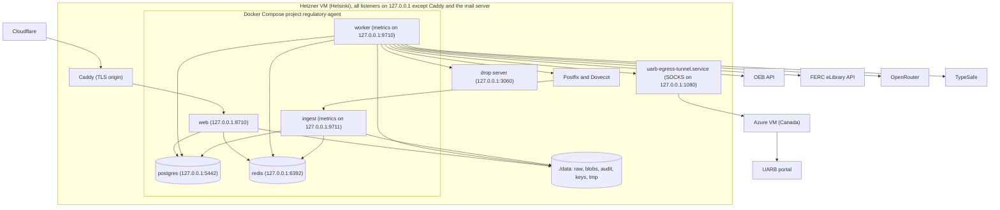

# Architecture

This document describes the processes, the data stores, the external services and the data flow of the agent. [DESIGN.md](../../DESIGN.md) tells why the architecture has this form.

## 1. Overview

The agent is 1 Python 3.12 application. 1 container image contains all of its processes. Docker Compose runs the processes on 1 Hetzner Cloud VM. The same VM also runs Postfix, Dovecot, Caddy, the drop server and services that are not part of the agent.

## 2. Processes

All app processes use the image `regulatory-agent`. The entry point is `ragent` (`agent/cli.py`).

| Process | Command | Restart | Memory limit | Data access |
|---|---|---|---|---|
| `ingest` | `ragent ingest` | Always | 512 MB | `./data` read and write |
| `worker` | `ragent worker` | Always | 3 GB | `./data` read and write |
| `web` | `ragent web` | Always | 512 MB | `./data/blobs` read-only |
| `migrate` | `ragent migrate` | 1 time for each deploy | 256 MB | None |
| `db-grants` | `psql -f /sql/grants.sql` | 1 time for each deploy | 64 MB | `deploy/sql` read-only |
| `retention` | `ragent purge` | From a systemd timer (profile `ops`) | 256 MB | `./data` read and write |
| `postgres` | Postgres 16 (digest-pinned) | Always | 1 GB | Volume `pgdata` |
| `redis` | Redis 7 (digest-pinned) | Always | 384 MB | Volume `redisdata` |

### 2.1 ingest

Ingest keeps 1 IMAP connection to the mailbox `agent@hsingh.app`. It uses IMAP IDLE and issues IDLE again at least every 5 min. It writes a heartbeat key to Redis at least every 60 s. Ingest applies the inbound ceiling before it reads a message. It applies the pre-authentication limits before it stores the message or asks DNS. [Request flow](request-flow.md) gives the order of the steps.

### 2.2 worker

The worker is an arq worker. It runs these job types:

| Job | Trigger | Time limit |
|---|---|---|
| `process_request` | A request job from ingest, the sweeper or the outbox | 1200 s (`job_timeout_s`) |
| `send_outbound` | An email in the outbox that did not go out at the first try | 300 s |
| `sweep` | Every 5 min, and at start | Default |
| `metrics.refresh` | Every 1 min, and at start | Default |
| `audit.export_job` | Every day at 00:30, and at start | Default |
| `retention.purge_job` | Every day at 03:15. It does nothing if the database role cannot delete rows. | 3600 s |
| `reconcile.reconcile_job` | Every day at 06:00 | Default |

The worker runs at most 12 jobs at the same time (`max_jobs`). Most jobs wait for a portal or a model, so 12 jobs do not use 12 CPU cores. Each worker process has 1 Chromium browser and at most 4 browser sessions (`uarb_max_concurrent_sessions`).

### 2.3 web

The web process is a FastAPI application. Caddy sends `https://uarb.hsingh.app` to it on `127.0.0.1:8710`.

| Route | Purpose |
|---|---|
| `/c/{citation_id}` | The citation viewer. It shows the PDF page and marks the quoted passage (PDF.js and mark.js). |
| `/files/{document_id}/{sha256}.pdf` | The exact file version that the reply cites |
| `/files/{document_id}.{ext}` | A download of a Word file, a spreadsheet, a text file, or an audio or video file |
| `/r/{token}` and `/r/{token}.json` | The progress page of 1 request |
| `/status` | Aggregate service numbers, without personal data ([Observability](observability.md)) |
| `/privacy` | The privacy notice |
| `/.well-known/security.txt` | The security contact |
| `/health` | `{"ok": true, "db": true}` when the database answers |
| `/health/deep` | Operational data. Only a client on the host loopback gets it. All other clients get 404. |

The web process connects as `agent_web`. This role can read only what the pages show. It cannot read the extracted page text or the raw mail.

## 3. Data stores

### 3.1 Postgres

| Table | Contents |
|---|---|
| `requests` | 1 row for each inbound email: state, sender, parsed request, result, progress, attempts |
| `events` | The audit trail. Append-only. Each row has an actor, a component, a version and an HMAC of the subject. |
| `outbound` | The outbox. The worker seals each email body with AES-256-GCM. |
| `matters` | Cached matter data and listings for each provider |
| `documents` | 1 row for each (provider, matter, external id), with the SHA-256 of the stored file |
| `pages` | Extracted text for each page, 1 time for each SHA-256 |
| `citations` | The claims and quotes that the reply links to |
| `summaries` | Cited summaries, keyed by the exact versions of the documents |
| `suppression` | HMACs of addresses and domains that the gate must drop |

The migrations are in `migrations/`. They are idempotent. Only `ragent migrate` changes the schema.

### 3.2 Redis

Redis holds only data that the agent can make again from Postgres. The append-only file (AOF) is on, and the eviction policy is `noeviction`.

| Key prefix | Contents | Written by |
|---|---|---|
| `arq:*` | The job queue | ingest, worker |
| `rl:*` | Rate-limit counters (1 sorted set for each key and time window) | ingest, worker |
| `lock:*` | Locks: per request, single-flight, in-flight slot, UARB download | worker |
| `once:*` | One-time markers (for example, "the agent sent a slow-down notice") | ingest, worker |
| `budget:*` | Daily budgets: LLM spend, portal visits, bytes for each sender | worker |
| `breaker:*` | Circuit breaker state for each dependency | worker |
| `agent:paused` | The kill switch | `ragent pause` |
| `ingest:heartbeat` | The time of the last ingest loop | ingest |

No Redis key contains an email address or a client IP in clear text. Keys contain an HMAC of the normalised value.

### 3.3 Files

| Path | Contents |
|---|---|
| `data/raw/` | Raw inbound MIME, by SHA-256 |
| `data/blobs/` | Downloaded regulator files, by SHA-256 |
| `data/audit/` | Daily exports of the audit trail (JSONL, hash chain) |
| `data/keys/` | A generated at-rest key, only if `DATA_ENCRYPTION_KEY` and `AUDIT_HMAC_KEY` are not set |
| `data/tmp/` | Temporary files of the worker (ZIP files, browser downloads) |

## 4. External services

| Service | Use | Data that it receives |
|---|---|---|
| Postfix and Dovecot on the same host | Inbound mail (IMAP) and outbound mail (SMTP submission) | All email |
| Caddy and Cloudflare | TLS and the public entry point for the viewer | Viewer traffic |
| drop (`drop.hsingh.app`) | End-to-end encrypted download links | Only ciphertext |
| Azure VM in Canada | SOCKS egress for the UARB portal, through SSH | UARB portal traffic |
| UARB, OEB and FERC portals | Source of the documents | Our egress IP and our queries |
| OpenRouter (DeepSeek, Qwen) | Triage fallback and summaries, zero-data-retention endpoints only | Email text (triage fallback), public document text (summaries) |
| TypeSafe | Jev triage and citation support checks | Email subject and body, public document excerpts. Not zero-data-retention. |

## 5. Network

- Postgres, Redis, the web process, the worker and ingest metrics (ports 9710 and 9711) and the SOCKS tunnel listen only on 127.0.0.1.
- The app containers use the host network mode. The browser in the worker must reach the SOCKS tunnel on the host loopback.
- `deploy/postgres/pg_hba.conf` refuses the superuser over TCP. The superuser is for break-glass use through `docker compose exec` only.
- Caddy sets `X-Real-IP` and `X-Forwarded-For` to the real client IP. It overwrites any value from the client. The web rate limiter uses this IP.

## 6. Container security settings

Each app container:

- runs as uid 1000, with a read-only root file system;
- drops all Linux capabilities and sets `no-new-privileges`;
- has limits for memory, CPU and process count;
- gets only the secrets it needs, from `deploy/env/<service>.env` (mode 600).

`deploy/split-env.sh` makes the per-service env files from `.env`. `deploy/env/services.toml` tells which keys each service gets. A key that no service claims goes to no service.

The release image has no `pip`. Python dependencies come from `requirements.lock` with `--require-hashes`. Each base image has a digest pin.

## 7. Code layout

| Path | Contents |
|---|---|
| `agent/mail/` | IMAP ingest, MIME parser, SPF/DKIM/DMARC, loop detection, outbound mail |
| `agent/gate/` | Rules, Jev triage, LLM triage |
| `agent/providers/` | Provider interface, UARB, OEB, FERC, shared file and HTTP code, browser pool |
| `agent/citations/` | Page text extraction, quote checks, cited summaries, Jev citation check |
| `agent/delivery/` | ZIP package, drop client, delivery policy |
| `agent/web/` | Viewer, progress page, web rate limiter |
| `agent/pipeline.py` | The request state machine |
| `agent/worker.py` | Queue worker, retries, sweeper, scheduled jobs |
| `agent/outbox.py` | Durable email delivery |
| `agent/store.py` | CAS transitions, events, caches |
| `agent/limits.py`, `agent/breaker.py` | Rate limits, budgets, locks, circuit breakers |
| `agent/audit.py`, `agent/retention.py`, `agent/admin.py` | Audit trail, retention and DSAR, operator commands |
| `migrations/` | SQL schema |
| `deploy/` | Deploy, cutover, backup and compliance scripts, SQL roles, Redis ACL, Caddy, systemd units, observability |
