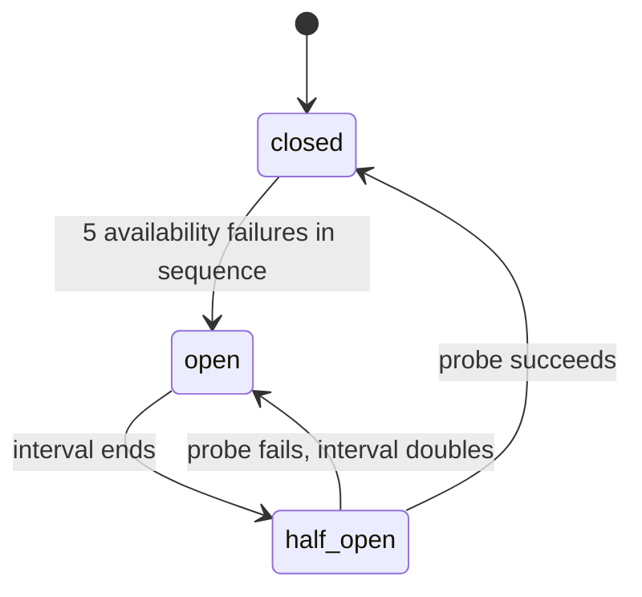

# Reliability

This document tells how the agent continues after failures: retries, backoff, circuit breakers, timeouts, locks, the outbox and idempotency. The code is in `agent/worker.py`, `agent/pipeline.py`, `agent/breaker.py`, `agent/limits.py` and `agent/outbox.py`.

NOTE: The agent is an MVP on 1 host. It has no service level agreement. Postgres, Redis, the mail server and the UARB egress tunnel are single points of failure.

## 1. Principles

1. An authenticated request always ends with exactly 1 useful reply, or with 1 apology.
2. Postgres counts the attempts. The queue does not count them.
3. A failure that is not the fault of the request does not use an attempt. The request "parks".
4. Each step can run again. A retry uses all data that is already stored.
5. Each email goes out "at least once" with a fixed Message-ID. A second, different email is not possible.
6. The summary is "best effort". The documents go out also when the summary fails.

## 2. Retry policy

### 2.1 Parameters

| Parameter | Default | Purpose |
|---|---|---|
| `max_attempts` | 8 | Attempts before the final attempt |
| `request_deadline_s` | 7200 s (2 h) | After this time from receipt, the attempt is final |
| `retry_base_s` | 30 s | The first backoff step |
| `retry_cap_s` | 900 s | The largest backoff step |
| `pipeline_timeout_s` | 1080 s | The limit for 1 try inside the job |
| `job_timeout_s` | 1200 s | The arq job limit. It is larger than the try limit, so the try stops first. |

An attempt is final when 1 of these conditions is true:

- `requests.attempts` is 8 or more;
- the request is older than 2 h;
- the arq try counter is 1000 or more (a safety limit; arq never stops a job by itself).

A final attempt that fails ends the request in `failed`. An authenticated sender gets 1 apology.

### 2.2 Backoff formula

For the attempt number `n` (1, 2, 3 ...):

```text
step(n)  = min(retry_cap_s, retry_base_s * 2^(n - 1))
delay(n) = max(retry_after, U(0.5, 1.0) * step(n))
```

`U(0.5, 1.0)` is a uniform random factor between 0.5 and 1.0. `retry_after` is the `Retry-After` value of the dependency, if the dependency sent this header. The worker never retries sooner than that value.

| Attempt that failed | `step(n)` | Delay before the next attempt |
|---|---|---|
| 1 | 30 s | 15 s to 30 s |
| 2 | 60 s | 30 s to 60 s |
| 3 | 120 s | 60 s to 120 s |
| 4 | 240 s | 120 s to 240 s |
| 5 | 480 s | 240 s to 480 s |
| 6 | 900 s | 450 s to 900 s |
| 7 | 900 s | 450 s to 900 s |
| 8 | Final attempt | None |

The total of the delays is 1365 s to 2730 s (approximately 23 min to 46 min). The try time adds to this. Parked time adds to this, but the 2 h deadline stops it.

### 2.3 Errors that are never retried

| Exception | Cause |
|---|---|
| `MatterNotFound` | The portal said that the matter does not exist |
| `ProviderRejected` | HTTP 400 or 403, or a file type that the agent does not deliver |
| `TooLarge` | A file or a request over its size budget |
| `DeliveryFailed` | SMTP 5xx for our email |
| `WaitedTooLong` | The request waited for a limit until its deadline |

Errors of Postgres, Redis, the file system or the network (`OSError`) become a retry with the same backoff. They never become an arq failure.

### 2.4 Parked tries

A parked try queues the job again and refunds its attempt.

| Cause | Wait before the next try |
|---|---|
| A circuit breaker is open | The time until the next probe, plus 0 s to 60 s |
| Another job holds the request lock | 30 s to 60 s |
| Another job holds the work lock (single-flight or download lock) | 30 s to 60 s |
| The kill switch is on (`ragent pause`) | 60 s plus 0 s to 60 s |
| The sender has 2 requests in `fetching` or `packaging` | 30 s plus jitter |
| The daily visit budget of the portal is spent | The lower of 600 s and the time to 00:00 UTC, plus jitter |

A request still parks only until its deadline. At the deadline, a breaker that is still open becomes a final error. A wait for a limit becomes `WaitedTooLong`.

## 3. Circuit breakers

### 3.1 Dependencies

| Breaker | Guards |
|---|---|
| `uarb`, `oeb`, `ferc` | Each portal visit (matter, list, download batch) |
| `drop` | Each upload to drop |
| `smtp` | Each outbound email |
| `openrouter:<model>` | Each LLM call, 1 breaker for each model |
| `typesafe` | Each Jev call |

The state is in Redis, so all worker processes share it.

### 3.2 States and formulas



| Parameter | Default |
|---|---|
| `breaker_failures` | 5 failures in sequence |
| `breaker_open_s` | 60 s, the first open interval |
| `breaker_open_cap_s` | 600 s, the largest interval |
| Probe key lifetime | 120 s |
| State lifetime in Redis | 24 h |

```text
interval(1) = breaker_open_s
interval(k) = min(2 * interval(k - 1), breaker_open_cap_s)   after a failed probe
open_until  = now + interval(k) * U(0.8, 1.2)
```

The random factor of 0.8 to 1.2 prevents breakers that opened together from a probe at the same time. In the half-open state, exactly 1 caller (the probe) can call the dependency. Other callers get `Open` immediately.

### 3.3 What counts as a failure

Only availability failures count: timeouts, connection errors, HTTP 5xx, 408 and 429, SMTP 4xx and SMTP connection errors. These results do not count, because the dependency answered:

- `MatterNotFound`, `ScrapeError`, `ProviderRejected`, `TooLarge`, `DeliveryFailed`;
- SMTP 5xx (a problem with the message, not with the server).

A successful answer resets the count.

If Redis is not available, each breaker lets calls through and writes a warning. A breaker is an optimisation. It is never a reason to stop work.

## 4. Timeouts

| Operation | Limit | Source |
|---|---|---|
| 1 try of a request | 1080 s | `pipeline_timeout_s` |
| 1 request job in arq | 1200 s | `job_timeout_s` |
| 1 outbound email job | 300 s | `agent/worker.py` |
| 1 browser action or navigation | 60 s | `browser_nav_timeout_ms` |
| UARB: 1 file, from click to saved file | 600 s | `agent/providers/uarb.py` |
| UARB: a transfer without growth | 60 s | Same as the browser action limit |
| UARB: result of the matter search after Enter | 20 s, then 1 click on Search | `agent/providers/uarb.py` |
| OEB and FERC: 1 HTTP request | 60 s, connect 10 s | `agent/providers/http.py` |
| OEB and FERC: 1 file download | 600 s | `agent/providers/http.py` |
| LLM: 1 attempt on 1 model (hard deadline) | 90 s | `llm_timeout_s` |
| LLM: wait for a 429 on the same model | At most 2 s for each wait, 4 s for each call | `agent/llm.py` |
| TypeSafe: 1 call, retries included | 10 s, connect 5 s, at most 3 attempts | `typesafe_deadline_s` |
| drop: 1 upload | 300 s, at most 4 attempts for each HTTP request | `agent/delivery/drop.py` |
| DNS: 1 lookup | 3 s | `agent/mail/auth.py` |
| SPF: 1 evaluation | 10 s in total | `agent/mail/auth.py` |
| Redis socket (queue) | 5 s | `agent/queue.py` |
| Redis call from the web rate limiter | 0.25 s | `agent/web/ratelimit.py` |
| IMAP: 1 IDLE cycle | 5 min | `agent/mail/ingest.py` |

## 5. Locks

All locks are in Redis. While a holder runs, a background task extends the lock every TTL/3. The TTL only limits how long a crashed holder blocks other jobs.

| Lock | TTL | Maximum wait | Purpose |
|---|---|---|---|
| `request:<id>` | 120 s | 2 s | 1 job for each request at a time |
| `sf:<provider>:<matter>:<category>` | 120 s | 300 s | Single-flight: 1 portal visit for many requests |
| `inflight:<sender>` | 30 s | 30 s | Counts and takes an in-flight slot in 1 step |
| `uarb:download` | 180 s | 600 s | Serialises the UARB click-to-file step for the egress IP |

If Redis does not answer during a renewal, the holder tries again. If the lock expired, the holder writes the error `lock.lost`.

## 6. Outbox

The worker renders each email and stores it in `outbound` in the same transaction as the state change that decides it. The worker then tries to send it immediately.

| Rule | Value |
|---|---|
| Kinds | `ack`, `reply`, `notice` |
| Message-ID | `<kind.request_id@hsingh.app>`, fixed before the first send |
| Body at rest | Sealed with AES-256-GCM |
| First try | Immediately after the commit (`send_now`) |
| Later tries | The `send_outbound` job |
| Backoff after `a` failed sends | `U(0.5, 1.0) * min(3600 s, 60 s * 2^(a - 1))` |
| Maximum age | 48 h, then `undeliverable` |
| SMTP 5xx | Permanent: `undeliverable`. The request ends `failed`. An alert goes to the log. |
| SMTP 552 for a reply with an attachment | The request returns to `packaging` with "link only". The outbox sends the reply again with a link. |
| SMTP breaker open | The email waits without a failed try |
| Kill switch on | The email waits. The outbox sends nothing. |

Order rules:

- A queued acknowledgement goes out before the reply of its request.
- When the outbox sends the reply, queued acknowledgements and delay notices of that request become `superseded`. The outbox never sends them.
- The outbox marks the reply as sent in the same transaction as the move of the request to its final state.

While the outbox sends an email, it locks the row (`FOR UPDATE SKIP LOCKED`). A second sender skips the row.

## 7. Sweeper

The sweeper runs every 5 min and at worker start.

1. It finds requests that are not settled and did not change for 15 min.
2. If a request has no attempts left or is past its deadline, the sweeper finishes it. An authenticated sender gets 1 apology.
3. Otherwise, the sweeper queues the request again after a random delay of 0 s to 60 s.
4. It queues outbound emails again if they are more than 5 min overdue.

The job id is the request id. For this reason, the sweeper never makes a second copy of a job that is in the queue or in progress. While the kill switch is on, the sweeper does not send apologies.

## 8. Dead letters and reconciliation

Each move to `failed` writes a `dead_letter` event and an ERROR log line with `alert=true`. This occurs on all paths: retries used, deadline, undeliverable mail.

The daily job `reconcile` (06:00, and `ragent reconcile`) looks for these problems:

- requests that did not move for more than 30 min;
- authenticated requests in `done` without a sent reply;
- outbound mail queued for more than 1 h, or `undeliverable`;
- documents whose stored file is not on disk;
- citations whose file version is different from the current version of their document;
- a rejection reason that occurs more than 3 times as often as its 7-day average (at least 10 times).

## 9. Ingest durability

1. Ingest reads each message without the `\Seen` flag.
2. It stores the raw MIME and the request row.
3. It puts the job on the queue.
4. Only then, it sets `\Seen`.

A crash before step 4 leaves the message unread. The next sweep reads it again. The unique Message-ID makes the second insert do nothing.

| Rule | Value |
|---|---|
| IDLE cycle | At most 5 min, then a new sweep |
| Heartbeat | `ingest:heartbeat` at least every 60 s. The health check wants an age below 600 s. |
| Dropped connection | Found immediately. New connection after 1 s to 60 s, with jitter. |
| Disk guard | Below 5,000,000,000 bytes free, ingest leaves all mail unread |
| Redis AOF | `appendfsync everysec`. The sweeper rebuilds lost queue entries from Postgres. |

## 10. Degraded modes

| Dependency down | Effect |
|---|---|
| OpenRouter (all models) | Triage uses Jev and the rules. Replies go without a summary. |
| TypeSafe | Triage uses the LLM. Citation checks use the LLM. |
| OpenRouter and TypeSafe | Triage uses only the rules. Doubtful emails get a question, never a fetch. |
| drop | ZIPs up to 7,000,000 bytes go as attachments. Larger ZIPs wait for drop. |
| SMTP | Emails wait in the outbox for up to 48 h |
| A portal | Requests for that portal retry and park, then get 1 apology |
| UARB egress tunnel | UARB requests fail after their retries. OEB and FERC continue. |
| Redis | No queue: nothing moves. Breakers and the web rate limiter let calls through. |
| Postgres | Nothing moves. Mail stays unread in the mailbox. |
| Disk below 5 GB free | Ingest leaves mail unread. Downloads stop with a retryable error. |

## 11. Idempotency

| Hazard | Guard |
|---|---|
| The same email arrives 2 times | `UNIQUE(message_id)`. A message without a Message-ID gets 1 from its SHA-256. |
| A crash after the IMAP fetch and before the commit | `\Seen` is set last. The message is read again. |
| The enqueue after the insert failed | Ingest puts the job of a duplicate message on the queue again if its row is still in `received` |
| 2 jobs for 1 request | The job id is `req:<request id>`, plus the lock `request:<id>` |
| 2 jobs move 1 request at the same time | Each transition is a compare-and-set on the current state |
| A crash between the SMTP send and the commit | Fixed Message-ID. The retry sends the same message. |
| A short reply fails to send | The outbox stores it with its target state. The retry sends it again. |
| A reply after the acknowledgement was lost | The acknowledgement goes out before the reply, or never |
| A retry counts against a rate limit again | The request id is the member in the rate-limit set |
| A sweep counts a message against the inbound ceiling again | The member is `<uidvalidity>:<uid>` |
| A retry counts delivered bytes again | A Lua script with a marker adds the bytes 1 time for each request |
| A retry uploads the ZIP again | The worker stores the drop link for the same files (sealed) and uses it again |
| A retry makes new citation links | The citations of the request are used again |
| A retry calls the LLM for the same summary | The summary cache key is the summary version, the matter and the SHA-256 values |
| The worker extracts text again | The key of `pages` is the SHA-256. Inserts use `ON CONFLICT DO NOTHING`. |
| The worker downloads the same file for 2 matters | The key of the blob store is the SHA-256 |
| 10 requests for the same matter | The single-flight lock. The other requests read the cache. |
| A worker stops in the middle of a job | The lock expires after 120 s. The sweeper queues the request again after 15 min. |
| The operator releases the kill switch | Parked requests continue where they stopped. The agent sent no apology. |

## 12. Tests

The integration suite runs the pipeline against real Postgres and Redis with a fake portal, a fake LLM and a fake SMTP server. On 2026-10-05, `pytest -m integration --co` collected 183 tests. 60 of them are in `tests/reliability/`: dependency failures, LLM failures, mail failures and queue semantics.
