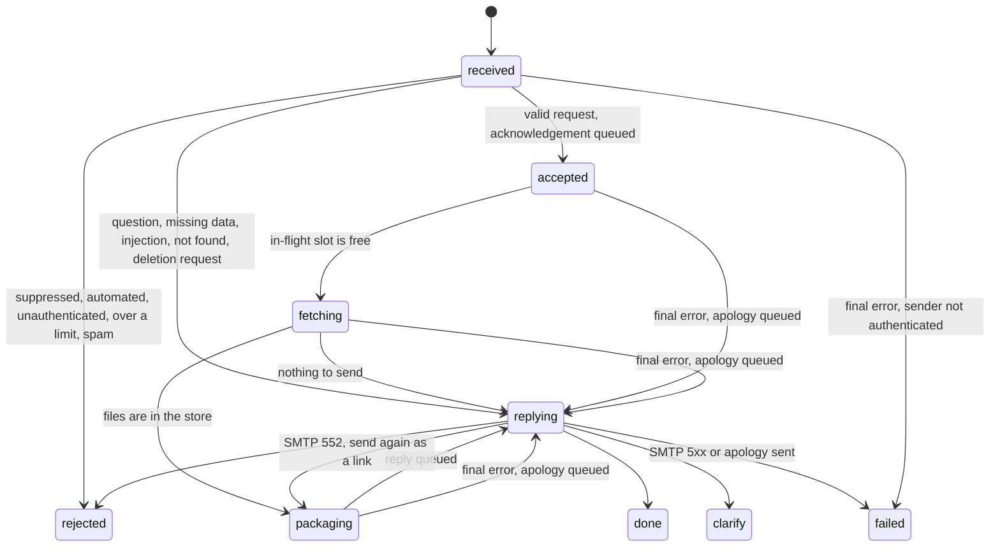

# Request flow

This document gives each step from the inbound email to the reply. The code is in `agent/mail/ingest.py`, `agent/worker.py`, `agent/pipeline.py` and `agent/outbox.py`.

## 1. Summary

| Phase | Process | Result |
|---|---|---|
| A. Ingest | `ingest` | A request row in `received`, and 1 job on the queue |
| B. Job start | `worker` | The worker counts 1 attempt, or the job parks |
| C. Gate | `worker` | `rejected`, a short reply, or `accepted` with an acknowledgement |
| D. Fetch | `worker` | The documents are in the content-addressed store |
| E. Package and summary | `worker` | A ZIP (link or attachment) and a cited summary |
| F. Reply | `worker` (outbox) | The outbox sends the reply. The request is `done`. |

Measured times (README, "Measured"): the acknowledgement arrives approximately 3 s after the email. A cold UARB request for 10 PDFs took approximately 52 s. A repeat request from the cache takes approximately 3 s.

## 2. State machine

Each transition is 1 SQL statement with a compare-and-set (CAS) condition on the current state. If the request is not in the expected state, the statement changes nothing. Each transition also writes a `state:<name>` event. A transition that sends an email writes the email to the outbox in the same transaction.

A request in `replying` already has its reply in the outbox. A retry sends that reply again. It never makes a new reply.

## 3. Phase A: ingest

Before each sweep of the mailbox, ingest examines the free disk space. Below 5,000,000,000 bytes (`disk_min_free_bytes`), it stops the sweep and leaves all mail unread.

Ingest then does these steps for each unread message, in this order:

1. Ingest asks for a place under the global inbound ceiling (120 messages each minute). If there is no place, the message stays unread. The next sweep starts within 60 s.
2. Ingest reads the size of the message. Above 5,000,000 bytes (`max_inbound_bytes`), it reads only the headers.
3. Ingest reads the message with `BODY.PEEK`. This does not set the `\Seen` flag.
4. Ingest parses the MIME.
5. Ingest applies the pre-authentication limits for each client IP and each claimed From domain.
6. Ingest stores the raw MIME in `data/raw/`, by SHA-256.
7. Ingest inserts the request row. The row is unique on Message-ID.
8. Ingest puts the job on the queue. The job id is `req:<request id>`.
9. Ingest sets the `\Seen` flag.

A malformed message gets its row directly in `rejected` (`malformed:<reason>`). Ingest puts no job on the queue for it.

A message over a pre-authentication limit gets different treatment. Ingest stores only its headers, creates the row in `rejected` (`preauth_rate_limited`) and sets `\Seen`. It puts no job on the queue, and nobody gets a reply.

A message without a Message-ID gets a stable Message-ID from the SHA-256 of its bytes. Then a second delivery of the same message is also a duplicate.

If the row exists and is still in `received`, ingest puts its job on the queue again. The first enqueue possibly failed.

Ingest also does these tasks:

- It writes `ingest:heartbeat` to Redis at least every 60 s.
- It issues IMAP IDLE again at least every 5 min.
- It finds a dropped connection immediately, then connects again with a backoff of 1 s to 60 s.
- Every hour, it expunges messages whose request settled more than 7 days before.

## 4. Phase B: job start

1. The worker takes the lock `request:<id>`. The lock lives 120 s, and the worker renews it every 40 s.
2. If another job holds the lock for more than 2 s, this job parks for 30 s to 60 s.
3. The worker adds 1 to `requests.attempts` in Postgres. A settled request stops here.
4. The attempt is final when `attempts` is 8 or more, or the request is older than 2 h.
5. If the kill switch is on, the job parks for 60 s plus jitter. The worker refunds the attempt.
6. The worker reads the raw MIME and parses it again.
7. The rest of the try must finish within 1080 s (`pipeline_timeout_s`).

## 5. Phase C: the gate

The gate does its checks in this order. The gate stops at the first check that gives a result.

| Order | Check | If it decides | Reply |
|---|---|---|---|
| 1 | Suppression list (DSAR or operator block) | `rejected` (`suppressed`) | None |
| 2 | Automated mail. Header signals: our marker header, X-Loop with our address, Auto-Submitted, Precedence, autoresponder headers, X-Auto-Response-Suppress and list headers. Other signals: our own address, a null return path, `multipart/report`, automated local parts, and an out-of-office subject in reply to our mail. | `rejected` (`automated:<reason>`) | None |
| 3 | Sender authentication (SPF, DKIM, DMARC alignment) | `rejected` (`unauthenticated:<reason>`) | None |
| 4 | Allowlist, only if `sender_auth_mode` is `allowlist` | `rejected` (`not_allowlisted`) | None |
| 5 | "DELETE MY DATA" in the subject, or on its own line in the body | `done` (`dsar_delete`) | 1 confirmation |
| 6 | Rate limits for each sender, each domain and global, hourly and daily | `rejected` (`rate_limited:<key>`) | At most 1 "slow down" notice |
| 7 | Thread cap: more than 5 requests in 1 thread from 1 sender | `rejected` (`thread_cap`) | None |
| 8 | Triage (rules, then Jev, then the LLM) | Refer to the next table | Refer to the next table |

If DNS does not answer during sender authentication, the gate raises a temporary error and the queue retries. On the final attempt, the gate drops the request silently. The agent never writes to an address that it did not authenticate.

### 5.1 Triage

1. If the LLM budget for the day is spent, only the rules decide.
2. Otherwise, the rules try first (`agent/gate/rules.py`).
3. If the rules cannot decide, 1 Jev request asks typed questions (`agent/gate/jev.py`).
4. If a Jev confidence gate fires, or Jev does not answer, the LLM classifier decides (`agent/gate/classify.py`).
5. If the LLM does not answer, Jev's question goes out. If Jev was also down, the cautious answer of the rules goes out.
6. A follow-up in a thread from the same sender, without a matter number, uses the matter of the earlier request. If the earlier email named more than 1 matter, the agent asks which matter.
7. An email can name more than 1 matter. The models only find the further matters. Code (`rules.category_for`) pairs each further matter with the 1 category that the words next to it name. Each pair becomes a request of its own, created in state `accepted` (refer to 5.3).

### 5.3 Emails with more than 1 matter

The first matter is the request of the email. Each further matter that code can pair with 1 category becomes a split request:

- It has the same sender, raw MIME, thread and receipt time as the email. Its `message_id` is `split:<matter>:<message id of the email>`, so a retry of the gate creates no second split.
- It does not go through the gate again. It counts against the sender, domain and global limits as 1 more request. It does not count against the thread cap.
- It gets no acknowledgement. The acknowledgement of the email names it. It gets its own reply in the thread.
- The count of documents comes from the words next to the matter. If those words have no count, a split request with the category of the first matter uses the count of the first matter. Other split requests use the maximum (10).

The agent does not fetch a further matter, and the reply names it, in these conditions: the words next to the matter name 0 or 2 or more categories, the email has a negation ("except"), the email names more than 3 matters (`MAX_MATTERS_PER_EMAIL`), or the sender is over a limit.

[Models](models.md) describes Jev and the LLM classifier. The models only select values. Code writes all text that the requester sees.

### 5.2 Decisions after triage

| Triage result | State | Reply |
|---|---|---|
| Spam | `rejected` (`spam`) | None |
| Injection attempt | `rejected` (`injection_attempt`) | 1 fixed text with an example request |
| Unrelated, in a thread with us ("thanks") | `rejected` (`unrelated_in_thread`) | None |
| Unrelated, first time today for this sender | `rejected` (`unrelated`) | 1 help text with the matter formats and categories |
| Unrelated, again on the same day | `rejected` (`unrelated_repeat`) | None |
| A matter number that no provider knows | `clarify` | A question with example matter numbers |
| A question, or no category, or the models are not sure | `clarify` or `done` | Matter data (if known) and a question that code writes |
| The matter does not exist | `done` | A "not found" message |
| A valid request | `accepted` | The acknowledgement with the progress link |
| A valid request that names further matters | `accepted`, and 1 split request in `accepted` for each further matter | 1 acknowledgement that names each matter. 1 reply for each matter. |

## 6. Phase D: fetch

1. The worker asks for an in-flight slot. A sender can have at most 2 requests in `fetching` or `packaging`.
2. If no slot is free, the request waits 30 s to 60 s without an attempt, until its deadline.
3. The worker calculates the byte budget: the lower of 600,000,000 bytes and the daily allowance of the sender.
4. The worker takes the single-flight lock for (provider, matter, category).
5. If the cached list of documents is younger than 6 h and covers the request, the worker uses it.
6. Otherwise, the worker spends 1 portal visit and lists the matter and the category in 1 session.
7. If the portal count is more than 0 but the list is empty, the worker raises a retryable error.
8. The worker keeps only rows with access "Public". It records the number of other rows.
9. The worker downloads the files that are not in the store. 1 download batch is 1 portal visit.
10. Each file passes its checks, then goes into `data/blobs/` by SHA-256.
11. The worker stops the downloads when the request uses all of its byte budget.

Each call to a portal uses the circuit breaker of the provider. Each portal visit first examines the daily visit budget of the provider. [Providers](providers.md) tells how each provider lists and examines its files.

At the end of the fetch, each listed document is in 1 of 3 groups:

- `files`: in the package;
- `failed`: the download failed after its retries;
- `skipped`: over the byte budget.

If all downloads failed, the try fails and the queue retries. If no file is left for another reason (for example, all rows are confidential), the agent replies with the reason and the request is `done`.

## 7. Phase E: package and summary

The worker does 2 tasks at the same time. If 1 task fails, the worker stops the other.

### 7.1 Package and delivery

1. The worker makes a ZIP with `README.txt` and `MANIFEST.csv`. The manifest lists the id, title, date and SHA-256 of each file.
2. If a drop link for the same files exists for this request, the worker uses it again.
3. Otherwise, the worker uploads the ZIP to the drop server. The link expires after 7 days or 25 downloads.
4. If drop fails and the ZIP is not larger than 7,000,000 bytes, the worker attaches it.
5. If drop fails and the ZIP is larger, the try fails and the queue retries.

### 7.2 Cited summary

1. The worker makes a cache key from the summary version, the matter and the sorted SHA-256 values.
2. If the `summaries` table has the key, the worker uses the cached summary. It makes no model call.
3. If the LLM budget for the day is spent, the reply goes without a summary.
4. The worker extracts the text of each PDF and DOCX file, 1 time for each SHA-256.
5. 1 LLM call writes a summary of at most 4 sentences and at most 5 claims. Each claim has a quote.
6. Code finds each quote in the page text. Code removes a claim that it cannot locate.
7. Code removes each claim or sentence with a figure that the sources do not contain.
8. For each claim, Jev tells if the quote supports the claim. If Jev cannot answer, the LLM check decides.
9. If fewer than 2 claims stay, the reply shows no claims.
10. The worker stores each claim as a citation with a random id.

The summary is "best effort". If any summary step fails, the documents still go out without a summary. [Quality and evals](quality-and-evals.md) gives the measured quality.

## 8. Phase F: reply

1. The worker renders the reply and writes it to the outbox with the move to `replying`.
2. The outbox sends the reply immediately.
3. If an acknowledgement for this request is still queued, the outbox sends it first.
4. When the outbox sends the reply, it moves the request to `done` in the same transaction.
5. The outbox never sends an acknowledgement or a delay notice that is still queued after the reply.

The reply contains:

- 1 sentence about the matter (title, type, dates, status) and the count for each category;
- what the agent downloaded, in which order, and what it did not include (confidential, failed or over budget);
- the download link with its expiry date, or the attachment;
- the summary and the key points. Each key point links to its passage in the viewer;
- the progress link.

## 9. When something fails

| Situation | Result |
|---|---|
| A retryable error before the final attempt | A `retry` event. The queue retries after the backoff ([Reliability](reliability.md)). |
| A breaker is open | The job parks without an attempt, until the deadline |
| An error on the final attempt, sender authenticated | 1 apology through the outbox. The request ends `failed`. |
| An error on the final attempt, sender not authenticated | No email. The request ends `failed`. |
| An error after the worker queued the reply | The outbox owns the request. The agent never replaces the reply with an apology. |
| A request that did not move for 15 min | The sweeper queues it again. If it has no attempts left or is past its deadline, the sweeper finishes it. |

The apology text names the cause in general terms: the regulator portal, the file service, or a problem on our side. It never blames the regulator for our own problem.
